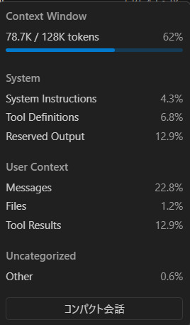

2026/3/14
タスク分割、依存関係抽出、github issuesとしての登録
を自動実行しようとしていて、(1)Github CLIを使用、(2)Node.jsスクリプトでoctokitを使用、の提案に対して(1)を選択。
github CLIのインストールをお願いしたところで、フリーアカウントのクレジット切れ
次回
→上の続き
→サービスの確認"github copilot"
→使っているモデルの確認"GPT-4.1 1x"
→料金体系の確認

---------------------------------------------

承知しました。GitHub CLI（gh）を使ってIssuesを自動作成する手順を案内します。

1. GitHub CLIのインストール
まだインストールしていない場合は、PowerShellで以下を実行してください：

または
公式サイト: https://cli.github.com/

2. gh CLIの認証
初回のみ、以下でGitHubにログインします（GITHUB_TOKENがあれば自動認識されます）：

3. Issue作成コマンド例
単発でIssueを作成する場合：

4. 複数Issueを一括作成したい場合
タスク一覧をCSVやテキストで用意
PowerShellやバッチでループしてghコマンドを実行
例（PowerShellスクリプト）：

ご希望であれば、全タスク分のスクリプトを生成しますのでお知らせください。
まずは上記の手順で1件テスト作成し、問題なければ一括登録用スクリプトを案内します。